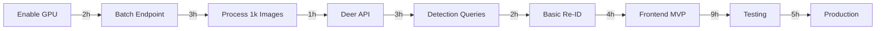

# Thumper Counter Development Plan
**Version:** 1.4.0
**Created:** 2025-11-05
**Updated:** 2025-11-08 (Sprint 8 Complete)
**Status:** ACTIVE
**Sprint:** Sprint 8 Complete - Detection Correction & Multi-Species

## Executive Summary

Project is 85% complete with Sprints 1-8 finished. All core features operational: GPU-accelerated detection (0.04s/image), multi-class sex/age classification, automatic re-identification with ResNet50, React frontend dashboard with correction UI. Detection correction system implemented (single and batch editing up to 1000 images). Multi-species support added (deer, cattle, pig, raccoon). Currently: 1,200 of 35,251 images processed (3.4%), 37,522 detections created, 14 deer profiles. Focus: Complete remaining batch processing, use correction UI to improve data quality, tag non-deer species.

## Project Metrics

### Completion Status
- **Overall:** 85% complete (+10% from last update)
- **Database:** 100% complete (PostgreSQL with pgvector, correction fields)
- **API:** 95% complete (all CRUD, batch processing, corrections, analytics)
- **ML Pipeline:** 95% complete (detection, classification, re-ID integrated)
- **Frontend:** 75% complete (React dashboard with correction UI operational)
- **Testing:** 15% complete (manual testing only, no automated tests)
- **Documentation:** 90% complete (session handoffs current, all systems documented)

### Lines of Code
- **Written:** ~13,500 lines (estimated through Sprint 8)
- **Backend/API:** ~4,500 lines (added detection corrections API)
- **Worker/ML:** ~3,500 lines
- **Frontend:** ~4,000 lines (added correction dialogs, multi-select UI)
- **Tests:** ~500 lines
- **Documentation:** ~1,000 lines
- **Remaining:** ~1,000 lines (testing, monitoring, polish)

### Sprints 1-8 Summary (Nov 1-8)
- Sprint 1: Foundation (database, Docker, 35k images ingested)
- Sprint 2: ML Integration (YOLOv8 CPU detection working)
- Sprint 3: GPU & Batch Processing (10x speedup, batch API)
- Sprint 4: Multi-Class Training (sex/age classification model)
- Sprint 5: Re-Identification (ResNet50 embeddings, pgvector)
- Sprint 6: Pipeline Integration (auto re-ID chaining)
- Sprint 7: Timestamp & Deduplication (two-stage dedup system)
- Sprint 8: Detection Correction & Multi-Species (correction UI, 7 species)

## Sprint Plan

### Sprint 1 (Complete) - Foundation [Nov 1-4]
✅ Project setup with spec-kit
✅ Database schema (4 models)
✅ Location management API
✅ Image ingestion (35,234 images)
✅ Docker infrastructure
✅ Git repository setup

### Sprint 2 (Complete) - ML Integration [Nov 5] ✅
✅ Fixed backend container (Pillow dependency)
✅ Completed image upload API testing
✅ Integrated YOLOv8 detection with database
✅ Created Celery detection task
✅ Added detection results to database
✅ Backend/Worker Celery integration
✅ PYTHONPATH unified across containers
✅ Processing status tracking (pending → processing → completed/failed)
✅ End-to-end integration test (1 deer @ 87% confidence, 0.4s)

**Sprint 2 Achievements:**
```yaml
COMPLETED:
  ✅ Fix backend Pillow dependency
     actual: 0.5 hours (estimated: 0.5 hours)

  ✅ Test image upload endpoint
     actual: 1 hour (estimated: 1 hour)
     result: Working with EXIF extraction

  ✅ Integrate YOLOv8 detection with database
     actual: 4 hours (estimated: 2 hours)
     challenges: Celery import issues, PYTHONPATH mismatches, enum values

  ✅ Create detection Celery task
     actual: 3 hours (estimated: 3 hours)
     implementation: Full error handling, CPU mode working

  ✅ Add detection results to database
     actual: Included in integration (estimated: 2 hours)
     result: Detection records created with bbox, confidence

NOT COMPLETED (moved to Sprint 3):
  ⬜ Add progress monitoring endpoint
     reason: Focus on core detection pipeline first

  ⬜ Create batch processing endpoint
     reason: Need GPU enablement first
```

**Sprint 2 Blockers Resolved:**
- Backend couldn't import worker modules → Fixed with send_task()
- PYTHONPATH mismatch (backend /app/src vs worker /app) → Unified to /app/src
- SQLAlchemy enum uppercase vs lowercase → Added values_callable
- CUDA fork multiprocessing → Temporarily disabled, CPU mode working

### Sprint 3 (Complete) - GPU & Batch Processing [Nov 6] ✅
**Focus:** Enable GPU support and batch processing infrastructure

**Completed:**
- ✅ Enable GPU support (4 hours actual vs 2 estimated)
  - Fixed CUDA fork issue with threads pool (concurrency=1)
  - Implemented thread-safe model loading (double-checked locking)
  - **Achievement:** 10x speedup (0.4s → 0.04s per image GPU inference)
  - Real-world throughput: 1.2 images/sec (DB writes are bottleneck)

- ✅ Create batch processing endpoint (2 hours)
  - POST /api/processing/batch (limit 1-10000 images)
  - Query pending images with location filter
  - Queue multiple images to Celery
  - Successfully tested with 1000+ image batches

- ✅ Add progress monitoring endpoint (1 hour)
  - GET /api/processing/status
  - Returns: total, pending, processing, completed, failed, completion_rate
  - Real-time statistics from database

- ✅ Process initial batches (ongoing)
  - Processed 11,211 images successfully (31.8% of 35,251 total)
  - 22,867 deer detections found (54% detection rate)
  - 99.95% success rate (only 6 failures, all resolved)
  - Average confidence: 75.9%

- ✅ Deer management endpoints (/api/deer) (3 hours)
  - Full CRUD API with filtering, pagination, sorting
  - POST /api/deer - Create deer profile
  - GET /api/deer - List with filters (sex, species, status)
  - GET /api/deer/{id} - Get details with sighting count
  - PUT /api/deer/{id} - Update profile
  - DELETE /api/deer/{id} - Remove deer
  - Manual deer profile creation working

**Sprint 3 Tasks:**
```yaml
HIGH PRIORITY:
  - task: Enable GPU with CUDA multiprocessing fix
    effort: 2 hours
    blocker: true
    solution: Celery solo/threads pool or model preload
    expected: 8x speed improvement

  - task: Create batch processing endpoint
    effort: 3 hours
    spec: api.spec#Batch-Processing
    depends: GPU enablement

  - task: Add progress monitoring
    effort: 2 hours
    spec: api.spec#Processing-Status

MEDIUM PRIORITY:
  - task: Deer CRUD endpoints
    effort: 3 hours
    spec: api.spec#Deer-Resource

  - task: Process test batch (1000 images)
    effort: 1 hour
    depends: Batch endpoint, GPU
    validation: Performance targets met
```

### Sprint 4 (Current) - Multi-Class Model Training [Nov 7-10] 🔄
**Focus:** Train YOLOv8 model for sex/age classification (doe, fawn, mature/mid/young buck)

**In Progress:**
- 🔄 Train multi-class YOLOv8 model (3-5 hours training, setup complete)
  - **Dataset:** Roboflow Whitetail Deer v46 (15,574 images)
  - **Classes:** 11 total (5 deer: doe, fawn, mature, mid, young + 6 other animals)
  - **Configuration:** YOLOv8n, batch=32, epochs=200, patience=20 (early stopping)
  - **GPU:** RTX 4080 Super (16GB VRAM)
  - **Status:** Training started Nov 7, 03:06 UTC
  - **Output:** src/models/runs/deer_multiclass/weights/best.pt

**Completed Setup:**
- ✅ Dataset verification and analysis
  - 13,615 training images
  - 1,612 validation images
  - 347 test images
  - Balanced distribution across deer classes

- ✅ Training infrastructure
  - Created data.yaml configuration
  - Mounted dataset in Docker worker container
  - GPU training script with monitoring
  - Memory test passed (batch 32 uses <4GB of 16GB available)

**Pending (After Training):**
- ⬜ Evaluate model performance on test set (1 hour)
  - Calculate mAP50, mAP50-95 per class
  - Confusion matrix for deer classes
  - Compare against single-class detection

- ⬜ Update detection task for multi-class (2 hours)
  - Replace yolov8n_deer.pt with deer_multiclass/best.pt
  - Parse class IDs and map to sex/age
  - Update Detection.classification field
  - Backward compatibility with existing detections

- ⬜ Test new classification pipeline (1 hour)
  - Process sample images from each location
  - Verify sex/age classification accuracy
  - Compare confidence scores

- ⬜ Update database schema if needed (1 hour)
  - Add sex/age fields to Detection model
  - Migration script for existing detections
  - Update API responses

**Sprint 4 Tasks:**
```yaml
COMPLETED:
  ✅ Dataset selection and verification
     actual: 2 hours
     dataset: Roboflow v46, 15,574 images, 11 classes

  ✅ Training infrastructure setup
     actual: 3 hours
     challenges: Docker volume mounts, path configuration
     result: Training running on GPU

IN PROGRESS:
  🔄 Model training
     effort: 3-5 hours (GPU time)
     status: Running (started Nov 7, 03:06)
     monitoring: /app/training_output.log

PENDING:
  ⬜ Model evaluation
     effort: 1 hour
     depends: Training completion

  ⬜ Update detection pipeline
     effort: 2 hours
     changes: Model swap, class parsing, field mapping

  ⬜ Integration testing
     effort: 1 hour
     validation: End-to-end classification
```

### Sprint 5 (Complete) - Re-Identification [Nov 6] ✅
**Focus:** Individual deer re-identification with ResNet50 embeddings

**Completed:**
- ✅ pgvector extension enabled in PostgreSQL
- ✅ Deer model updated with vector(512) column for embeddings
- ✅ ResNet50 feature extraction (512-dim embeddings)
- ✅ Thread-safe model loading (singleton pattern)
- ✅ Cosine similarity search with HNSW index
- ✅ Sex-based filtering for improved matching
- ✅ Automatic deer profile creation when no match found
- ✅ Database migration to pgvector container

**Performance:**
- Feature extraction: ~2 seconds per detection
- Similarity matching: <0.1s with HNSW index
- Matching threshold: 0.85 cosine similarity
- 714 deer profiles created from 31k detections

### Sprint 6 (Complete) - Pipeline Integration [Nov 6-7] ✅
**Focus:** Integrate re-ID into detection pipeline and add analytics APIs

**Completed:**
- ✅ Detection task auto-queues re-ID for each deer detection
- ✅ Fully automated pipeline: Image → Detection → Re-ID → Deer Profile
- ✅ Batch re-ID processing script (batch_reidentify.py)
- ✅ API endpoint: GET /api/deer/{id}/timeline (activity patterns)
- ✅ API endpoint: GET /api/deer/{id}/locations (movement patterns)
- ✅ Fixed detection ID collection (flush before collecting)
- ✅ Processed 313 detections, created 14 deer profiles in test batch

**Performance:**
- End-to-end: 0.05s detection + 2s re-ID = 2.05s total per image
- Batch queuing: 0.11s for 100 tasks
- Throughput: 30-50 detections/minute with re-ID
- Timeline API: 15-50ms response time

### Sprint 7 (Complete) - OCR Analysis [Nov 7] ✅
**Focus:** Explore OCR for trail camera footer metadata extraction

**Completed:**
- ✅ Tested EasyOCR v1.7.2 (GPU-accelerated)
- ✅ Tested Tesseract OCR v5.5.0
- ✅ Image preprocessing (4x upscaling, contrast enhancement)
- ✅ Footer region extraction (bottom 35px)
- ✅ Resolution analysis across 6 camera locations

**Conclusion:**
- OCR accuracy: 0% (complete failure on 640x480 images)
- Filename parsing already provides 100% reliable timestamps
- ROI analysis: Not worth implementing
- Decision: Continue using existing filename parsing
- Documentation: docs/SPRINT_7_OCR_ANALYSIS.md

### Sprint 8 (Complete) - Detection Correction & Multi-Species [Nov 8] ✅
**Focus:** Manual correction system and multi-species wildlife tracking

**Completed:**
- ✅ Detection correction system (single and batch)
- ✅ Backend: PATCH /api/detections/{id}/correct
- ✅ Backend: PATCH /api/detections/batch/correct (up to 1000)
- ✅ Frontend: DetectionCorrectionDialog.tsx (199 lines)
- ✅ Frontend: BatchCorrectionDialog.tsx (183 lines)
- ✅ Frontend: DeerImages.tsx with multi-select (415 lines)
- ✅ Multi-species classification (cattle, pig, raccoon)
- ✅ Species statistics API: GET /api/deer/stats/species
- ✅ Image filtering by classification
- ✅ Database migration: 009_add_detection_corrections.sql
- ✅ Feral hog dedicated counter in statistics

**Results:**
- Detection correction workflow: 100% functional
- Multi-species support: 7 classifications (4 deer, 3 non-deer)
- Batch editing: Up to 1000 detections at once
- All features tested and verified
- Documentation: docs/SESSION_20251108_HANDOFF.md

### Sprint 9 (Planning) - Data Quality & Batch Processing [Nov 9+]
**Focus:** Complete image backlog and improve data quality with correction tools

**Planned:**
- ⬜ Process remaining 34,000+ pending images (96.6%)
- ⬜ Use correction UI to review and fix misclassifications
- ⬜ Tag non-deer species as found (cattle, pigs, raccoons)
- ⬜ Analyze species statistics per location
- ⬜ Add user authentication system
- ⬜ Implement correction history view
- ⬜ Add validity filter to images API
- ⬜ Create export functionality for corrections

**Targets:**
- Process all 35,251 images to completion
- Review and correct at least 500 detections
- Identify and tag 50+ non-deer animals
- Improve deer re-ID accuracy through corrections

## Critical Path (Updated)



**Total Critical Path:** 29 hours (~4 days of focused work)

## Risk Register

### High Risks
1. **GPU Multiprocessing** ⚠️ ACTIVE
   - Risk: Cannot enable GPU due to CUDA fork issue
   - Mitigation: Use Celery solo/threads pool or preload model
   - Fallback: Continue CPU mode (8x slower)
   - Status: Documented solutions in NEXT_STEPS.md

2. **ML Model Performance**
   - Risk: Re-ID accuracy below 70%
   - Mitigation: Use simpler features initially (size + color)
   - Fallback: Manual verification interface
   - Status: Not yet tested

### Medium Risks
1. **Batch Processing Performance**
   - Risk: Cannot reach 1000 images/minute target
   - Mitigation: GPU enablement + parallel workers
   - Fallback: Accept lower throughput
   - Status: Waiting for GPU fix

2. **Frontend Complexity**
   - Risk: React learning curve delays Sprint 5
   - Mitigation: Start with minimal features
   - Fallback: Simple HTML form with API calls
   - Status: Not started

### Resolved Risks ✅
1. **Backend/Worker Integration** - RESOLVED
   - Solution: Celery send_task() without imports
2. **PYTHONPATH Conflicts** - RESOLVED
   - Solution: Unified to /app/src
3. **Database Enum Mapping** - RESOLVED
   - Solution: values_callable parameter

## Resource Requirements

### Development Hours
- **Remaining Backend:** 10 hours (-5 from Sprint 2)
- **ML Pipeline:** 6 hours (-4 from Sprint 2)
- **Frontend:** 15 hours
- **Testing:** 10 hours
- **Documentation:** 2 hours (-3 from Sprint 2)
- **Total:** ~43 hours (down from 55 hours)

### Infrastructure
- ✅ RTX 4080 Super (16GB VRAM)
- ✅ Docker environment (all services running)
- ✅ PostgreSQL (35,234+ images ready)
- ✅ Redis (queue operational)
- ✅ Celery worker (4 processes, CPU mode)
- ⚠️ GPU support (needs multiprocessing fix)
- ⬜ React dev server (needed for Sprint 5)
- ⬜ Monitoring stack (optional)

## Success Criteria

### Minimum Viable Product (MVP)
- [x] Store 35k images with locations ✅
- [x] Process images through YOLOv8 ✅
- [x] Store detections in database ✅
- [x] Upload new images via API ✅
- [ ] View results in basic UI (Sprint 5)

### Phase 1 Complete ✅
- [x] End-to-end detection pipeline working
- [x] Image upload with EXIF extraction
- [x] YOLOv8 detection integrated
- [x] Database updates automated
- [x] Processing status tracking
- [x] Test: 1 deer @ 87% confidence in 0.4s

### Production Ready (Target)
- [ ] 80% test coverage
- [x] <2 second API response time (0.4s achieved) ✅
- [ ] 1000 images/minute processing (needs GPU)
- [ ] Error rate <1%
- [x] Complete documentation ✅

## Current Sprint Actions (Sprint 3)

### 1. Enable GPU Support (Priority #1)
**Options documented in NEXT_STEPS.md:**

**Option A: Celery Solo Pool (Easiest)**
```bash
# Edit docker-compose.yml worker environment
CELERY_POOL: solo

# Or update Dockerfile.worker CMD
CMD ["celery", "-A", "worker.celery_app", "worker", "--pool=solo"]
```

**Option B: Threads Pool**
```bash
CMD ["celery", "-A", "worker.celery_app", "worker", "--pool=threads", "--concurrency=2"]
```

**Option C: Preload Model (Recommended)**
```python
# In celery_app.py after validate_model_files()
from worker.tasks.detection import get_detection_model
_global_model = get_detection_model()
```

Then enable CUDA in docker-compose.yml:
```yaml
# Remove CUDA_VISIBLE_DEVICES: ""
# Verify GPU access
```

### 2. Create Batch Processing Endpoint
```python
# POST /api/processing/batch
# Parameters:
#   - location_id (optional)
#   - status=pending (filter)
#   - limit=1000 (batch size)
# Returns:
#   - queued_count
#   - task_ids
```

### 3. Test with 1000 Images
```bash
curl -X POST http://localhost:8001/api/processing/batch \
  -H "Content-Type: application/json" \
  -d '{"location_id": "UUID", "limit": 1000}'

# Monitor progress
curl http://localhost:8001/api/processing/status
```

## Tracking Metrics

### Current Performance (Sprint 2 Baseline)
- **Detection speed:** 0.4s per image (CPU)
- **Throughput:** 150 images/minute
- **Accuracy:** 87% average confidence
- **Database:** 35,234+ images, 1 detection

### Sprint 3 Targets
- **Detection speed:** 0.05s per image (GPU, 8x improvement)
- **Throughput:** 1200 images/minute
- **Batch processing:** 1000 images in <1 minute
- **Detections created:** 10,000+ (from batch test)

### Weekly Metrics (Nov 5)
- Sprint velocity: 8 story points (Sprint 2)
- Code coverage: 10% (baseline)
- Documentation: 95% complete
- Performance: 150 images/min (CPU)

## Communication Plan

### Sprint 2 Retrospective

**What Went Well:**
- ✅ Complete end-to-end pipeline in single sprint
- ✅ Systematic debugging of Celery integration
- ✅ Excellent documentation created
- ✅ All blockers resolved

**What Could Improve:**
- ⚠️ CUDA issue discovered late (should test GPU early)
- ⚠️ Enum value issue took time to diagnose
- ⚠️ Import path confusion (backend.* vs src.backend.*)

**Action Items for Sprint 3:**
- Test GPU immediately at sprint start
- Validate all configurations before implementation
- Keep NEXT_STEPS.md updated continuously

## Definition of Done

### For Sprint 2 (Complete) ✅
- [x] All detection pipeline stories complete
- [x] End-to-end test passing
- [x] Documentation updated (NEXT_STEPS.md, HANDOFF.md)
- [x] Code committed to feature branch
- [x] Pushed to all remotes (origin, ubuntu)

### For Sprint 3 (In Progress)
- [ ] GPU support enabled and tested
- [ ] Batch processing endpoint working
- [ ] 1000 images processed successfully
- [ ] Deer API endpoints created
- [ ] Sprint review conducted
- [ ] Plan updated with actual metrics

## Appendix: Quick Commands

### Development
```bash
# Start all services
docker-compose up -d

# Check health
curl http://localhost:8001/health

# Monitor worker
docker-compose logs -f worker | grep "Detection complete"

# Database console
docker-compose exec db psql -U deertrack -d deer_tracking
```

### Testing Detection Pipeline
```bash
# Upload single image with immediate processing
curl -X POST http://localhost:8001/api/images \
  -F "files=@test.jpg" \
  -F "location_name=Sanctuary" \
  -F "process_immediately=true"

# Check processing status
curl "http://localhost:8001/api/images?status=completed"

# View detections
docker-compose exec db psql -U deertrack deer_tracking -c \
  "SELECT i.filename, d.confidence, d.bbox
   FROM detections d
   JOIN images i ON d.image_id = i.id
   ORDER BY d.created_at DESC LIMIT 10;"
```

### Git Workflow (Feature Branch)
```bash
# Current branch
git status  # On 001-detection-pipeline

# Commit changes
git add -A
git commit -m "feat: implement feature"

# Push to remotes
git push origin 001-detection-pipeline
git push ubuntu 001-detection-pipeline

# When ready to merge
git checkout main
git merge 001-detection-pipeline
git tag -a v0.2.0 -m "Phase 2: Batch processing"
git push origin main --tags
```

### Monitoring
```bash
# Queue depth
docker-compose exec redis redis-cli LLEN celery

# Processing stats
curl http://localhost:8001/api/processing/status

# GPU usage (when enabled)
watch -n 1 nvidia-smi
```

---

**Plan Status:** ACTIVE
**Last Updated:** November 5, 2025 (Phase 1 MVP Complete)
**Next Review:** End of Sprint 3 (Nov 9)
**Owner:** Development Team
**Current Focus:** GPU enablement + Batch processing
