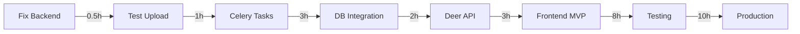

# Thumper Counter Development Plan
**Version:** 1.0.0  
**Created:** 2025-11-05  
**Status:** ACTIVE  
**Sprint:** Current Sprint 2 of 6

## Executive Summary

Project is 40% complete with core infrastructure operational. Remaining work focuses on ML pipeline integration, API completion, and basic UI creation. Target completion: 4 weeks.

## Project Metrics

### Completion Status
- **Overall:** 40% complete
- **Database:** 100% ✅
- **API:** 40% ⚠️
- **ML Pipeline:** 30% ⚠️
- **Frontend:** 0% ❌
- **Testing:** 5% ❌
- **Documentation:** 70% ✅

### Lines of Code
- **Written:** ~3,500 lines
- **Remaining:** ~5,000 lines estimated
- **Tests Needed:** ~2,000 lines

## Sprint Plan

### Sprint 1 (Complete) - Foundation [Nov 1-4]
✅ Project setup with spec-kit  
✅ Database schema (4 models)  
✅ Location management API  
✅ Image ingestion (35,234 images)  
✅ Docker infrastructure  
✅ Git repository setup  

### Sprint 2 (Current) - ML Integration [Nov 5-8]
🔄 Fix backend container (Pillow dependency)  
⬜ Complete image upload API testing  
⬜ Integrate YOLOv8 detection with database  
⬜ Create Celery task for batch processing  
⬜ Add detection results to database  
⬜ Create progress monitoring endpoint  

**Sprint 2 Tasks:**
```yaml
HIGH PRIORITY:
  - task: Fix backend Pillow dependency
    effort: 0.5 hours
    blocker: true
    
  - task: Test image upload endpoint
    effort: 1 hour
    depends: Fix backend
    
  - task: Create process_batch Celery task
    effort: 3 hours
    spec: ml.spec#Stage-2
    
  - task: Update database with detections
    effort: 2 hours
    spec: system.spec#Detection-Model

MEDIUM PRIORITY:  
  - task: Add progress monitoring
    effort: 2 hours
    spec: api.spec#Processing-Status
    
  - task: Create batch processing endpoint
    effort: 1 hour
    spec: api.spec#Trigger-Batch
```

### Sprint 3 - Core API Completion [Nov 9-12]
⬜ Deer management endpoints (/api/deer)  
⬜ Detection query endpoints (/api/detections)  
⬜ Basic re-identification (color/size features)  
⬜ Processing control endpoints  
⬜ WebSocket for real-time updates  

**Sprint 3 Tasks:**
```yaml
HIGH PRIORITY:
  - task: Create deer CRUD endpoints
    effort: 3 hours
    spec: api.spec#Deer-Resource
    
  - task: Implement detection queries
    effort: 2 hours
    spec: api.spec#Detection-Resource
    
  - task: Basic re-ID with features
    effort: 4 hours
    spec: ml.spec#Stage-4

MEDIUM PRIORITY:
  - task: WebSocket implementation
    effort: 3 hours
    spec: api.spec#WebSocket-Endpoints
    
  - task: Processing statistics
    effort: 2 hours
```

### Sprint 4 - Frontend MVP [Nov 13-16]
⬜ React project setup  
⬜ Image upload interface  
⬜ Location selection dropdown  
⬜ Processing status display  
⬜ Basic image gallery  

**Sprint 4 Tasks:**
```yaml
HIGH PRIORITY:
  - task: Initialize React app
    effort: 2 hours
    spec: ui.spec#Application-Structure
    
  - task: Create upload form
    effort: 3 hours
    spec: ui.spec#Upload-Component
    
  - task: Build image gallery
    effort: 4 hours
    spec: ui.spec#Image-Gallery

LOW PRIORITY:
  - task: Add Material-UI styling
    effort: 2 hours
    spec: ui.spec#Design-System
```

### Sprint 5 - Testing & Quality [Nov 17-20]
⬜ Unit tests for models (pytest)  
⬜ API integration tests  
⬜ ML pipeline validation  
⬜ Load testing (1000 images)  
⬜ Documentation updates  

**Sprint 5 Tasks:**
```yaml
HIGH PRIORITY:
  - task: Model unit tests
    effort: 3 hours
    coverage: 80%
    
  - task: API integration tests
    effort: 4 hours
    spec: api.spec#Testing-Strategy
    
  - task: ML accuracy validation
    effort: 3 hours
    spec: ml.spec#Testing-Requirements

MEDIUM PRIORITY:
  - task: Load testing setup
    effort: 2 hours
    target: 100 images/minute
```

### Sprint 6 - Polish & Deploy [Nov 21-24]
⬜ Production configuration  
⬜ Monitoring setup (Grafana)  
⬜ Backup automation  
⬜ User documentation  
⬜ Demo preparation  

## Critical Path



**Total Critical Path:** 27.5 hours (~4 days of focused work)

## Risk Register

### High Risks
1. **ML Model Performance**
   - Risk: Re-ID accuracy below 70%
   - Mitigation: Use simpler features initially
   - Fallback: Manual verification interface

2. **GPU Memory Issues**
   - Risk: OOM with batch_size=32
   - Mitigation: Dynamic batch sizing
   - Fallback: Reduce to 16

### Medium Risks
1. **Frontend Complexity**
   - Risk: React learning curve
   - Mitigation: Start with minimal features
   - Fallback: Simple HTML form

2. **Database Performance**
   - Risk: Slow queries with 35k images
   - Mitigation: Add indexes
   - Fallback: Pagination limits

## Resource Requirements

### Development Hours
- **Remaining Backend:** 15 hours
- **ML Pipeline:** 10 hours
- **Frontend:** 15 hours
- **Testing:** 10 hours
- **Documentation:** 5 hours
- **Total:** ~55 hours

### Infrastructure
- ✅ RTX 4080 Super (available)
- ✅ Docker environment (ready)
- ✅ PostgreSQL (running)
- ⬜ React dev server (needed)
- ⬜ Monitoring stack (optional)

## Success Criteria

### Minimum Viable Product (MVP)
- [x] Store 35k images with locations
- [ ] Process images through YOLOv8
- [ ] Store detections in database
- [ ] Upload new images via API
- [ ] View results in basic UI

### Production Ready
- [ ] 80% test coverage
- [ ] <2 second API response time
- [ ] 100 images/minute processing
- [ ] Error rate <1%
- [ ] Complete documentation

## Next Actions (Today)

1. **Fix Backend Container**
   ```bash
   echo "Pillow==10.1.0" >> requirements.txt
   docker-compose build backend
   docker-compose up -d backend
   ```

2. **Test Upload Endpoint**
   ```bash
   curl -X POST http://localhost:8001/api/images \
     -F "files=@test.jpg" \
     -F "location_name=Sanctuary"
   ```

3. **Create First Celery Task**
   ```python
   # In src/worker/tasks/process_images.py
   @celery.task
   def process_batch(image_ids: List[str]):
       # Implementation
   ```

## Tracking Metrics

### Daily Metrics
- Images processed: Target 5,000/day
- API endpoints completed: Target 2/day
- Tests written: Target 50/day
- Bugs fixed: Track in GitHub

### Weekly Metrics
- Sprint velocity: Story points completed
- Code coverage: Target +10%/week
- Documentation: Pages updated
- Performance: Processing speed

## Communication Plan

### Daily Standup Format
```
Yesterday: [Completed tasks]
Today: [Planned tasks]
Blockers: [Any issues]
```

### Weekly Review
- Sprint progress (% complete)
- Risk review
- Next sprint planning
- Stakeholder update

## Definition of Done

### For Each Feature
- [ ] Code complete and reviewed
- [ ] Unit tests written and passing
- [ ] Integration tests passing
- [ ] Documentation updated
- [ ] Deployed to development
- [ ] Stakeholder acceptance

### For Each Sprint
- [ ] All stories complete
- [ ] Sprint review conducted
- [ ] Retrospective documented
- [ ] Next sprint planned
- [ ] Metrics updated

## Appendix: Quick Commands

### Development
```bash
# Start all services
docker-compose up -d

# Run tests
docker-compose exec backend pytest

# Check logs
docker-compose logs -f backend worker

# Database console
docker-compose exec db psql -U deertrack -d deer_tracking
```

### Git Workflow
```bash
# Start feature
git checkout -b feature/ml-pipeline

# Commit with convention
git commit -m "feat(ml): add batch processing task"

# Push to servers
./scripts/push-all.sh
```

### Monitoring
```bash
# GPU usage
watch -n 1 nvidia-smi

# Queue depth
docker-compose exec redis redis-cli LLEN celery

# API health
curl http://localhost:8001/health
```

---

**Plan Status:** ACTIVE  
**Next Review:** End of Sprint 2 (Nov 8)  
**Owner:** Development Team
